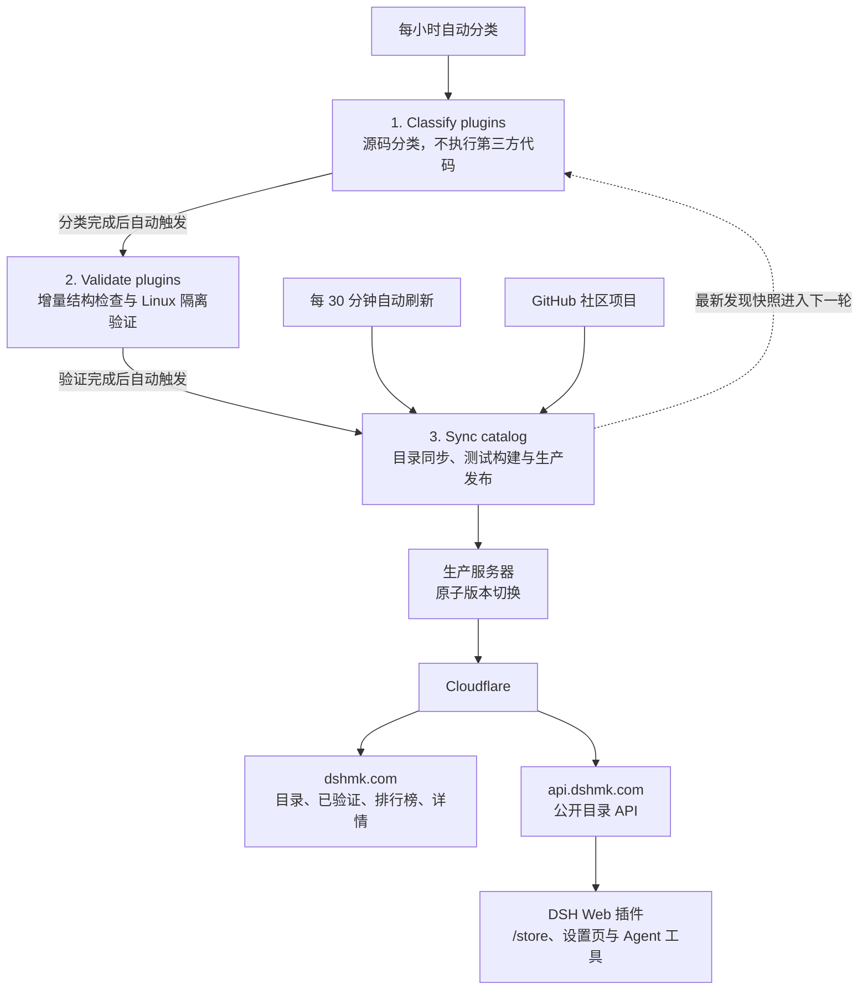

<p align="center">
  
</p>

<p align="center">
  <a href="https://linux.do" aria-label="访问 LINUX DO">
    
  </a>
  <a href="https://www.nodeseek.com/" aria-label="访问 NodeSeek">
    
  </a>
  <a href="https://dshmk.com/">
    
  </a>
  <a href="https://github.com/ZASENJC/dsh-plugins-store/actions/workflows/sync-catalog.yml">
    
  </a>
  <a href="LICENSE">
    
  </a>
  <a href="https://astro.build/">
    
  </a>
</p>

DSH 插件市场面向 DeepSeek Harness 生态，自动收录同时带有 [`dsh-plugin`](https://github.com/topics/dsh-plugin) 与 `deepseek-harness` Topic 的公开项目，提供目录检索、排行榜与 [公开 API](https://api.dshmk.com/)。配套的 [DSH Web 插件](packages/dsh-plugins-store/README.md)可独立安装并接入 `/store` 和 Agent 会话；验证结果来自固定源码 SHA 的结构检查与 Linux 隔离沙箱。

[访问 DSH 插件市场（DeepSeek Harness 插件目录）](https://dshmk.com/)

## 功能

- 自动收录同时带有 `dsh-plugin` 与 `deepseek-harness` Topic 的公开仓库，并排除归档仓库、Fork 和宿主应用
- 提供独立的 [目录](https://dshmk.com/)、[已验证](https://dshmk.com/verified)和 [排行榜](https://dshmk.com/ranking)页面，支持搜索、分类、筛选和排序
- 排行榜支持 24 小时 Star 增速、最多 Star、最新发布和最近更新；项目详情展示分类依据、同标签项目和验证进度
- 每 30 分钟自动同步 GitHub 仓库数据
- 配套 DSH Web 插件支持通过 `/store`、设置页和 Agent 会话浏览市场，并在用户明确请求和确认后安装、更新或移除 Web profile 插件

## 安装 DSH Web 插件

以下命令安装市场自身的 DSH Web 插件：

```sh
dsh plugin --profile web add npm:dsh-plugins-store
```

安装完成后重启 DSH Web 并刷新浏览器。源码安装、本地构建、卸载、市场工具及 `search-dsh-store` skill 的完整说明见 [`packages/dsh-plugins-store/README.md`](packages/dsh-plugins-store/README.md)。

## 项目截图

<details>
<summary>展开查看项目截图</summary>


</details>

## 收录与验证

项目分类优先使用仓库公开的 GitHub Topics，并与站内词典和词根规则比对。标签不足时，项目会保留为“其他”或“待识别”，不会根据名称强行推断。

收录仅表示仓库同时出现在 `dsh-plugin` 与 `deepseek-harness` Topic，且未被识别为归档仓库、Fork 或宿主应用，不代表项目已经通过安装、兼容性、安全性或质量验证。目录同步模块只读取公开仓库元数据，不执行第三方代码；可选 DSH Web 插件只会在用户阅读风险提示并明确确认后发起安装。

独立验证流程先对固定 SHA 做源码特征分类，再只对分类后的待验证目录进入一次性 Linux 沙箱。沙箱无商店密钥、非 root、资源受限，安装、激活、入口导入和 `apply` 调用均在隔离环境中完成；失败结果带错误码进入人工复核，不会进入源码排除名单。只有绑定当前仓库 ID、SHA、DSH 版本、平台和验证器版本的通过结果才显示“已验证”；该标记不等于完整安全审计或官方背书。

## 商店 API

商店提供公开、只读的完整目录接口：

```text
GET https://api.dshmk.com/
```

- 无需鉴权，不接收查询参数。
- 返回整个目录，不提供服务端搜索、筛选或分页；调用方应在本地处理。
- 目录约每 30 分钟刷新一次。请使用 `schemaVersion` 判断响应是否兼容，不要依赖仓库数组顺序。
- 生产响应允许跨域读取，浏览器插件可直接请求；命令行、Node.js 或其他服务端同样可直接调用。

### 使用示例

使用 `curl` 获取目录并读取基础信息：

```bash
curl --fail --silent --show-error \
  --header 'Accept: application/json' \
  https://api.dshmk.com/ \
  | jq '{schemaVersion, generatedAt, stats}'
```

在 Node.js 22+ 中筛选当前已验证的插件：

```js
const response = await fetch('https://api.dshmk.com/', {
  headers: { Accept: 'application/json' },
})

if (!response.ok) {
  throw new Error(`目录请求失败：HTTP ${response.status}`)
}

const catalog = await response.json()
if (catalog.schemaVersion !== 1 || !Array.isArray(catalog.repositories)) {
  throw new Error('不兼容的目录响应')
}

const verifiedPlugins = catalog.repositories.filter((repository) =>
  repository.projectType === 'plugin'
  && repository.validation?.overall === 'verified',
)
```

### 响应字段

| 字段 | 说明 |
| --- | --- |
| `schemaVersion` | 目录数据结构版本，当前为 `1` |
| `generatedAt` | 本次目录生成时间，ISO 8601 格式 |
| `source` | 收录来源，目前为 GitHub `dsh-plugin` 与 `deepseek-harness` Topic 交集 |
| `stats` | 收录数量及分类、项目类型、验证状态统计 |
| `repositories` | 仓库列表 |
| `repositories[].repositoryId` | GitHub 数字仓库 ID，作为稳定身份标识 |
| `repositories[].fullName` | GitHub 仓库全名，如 `owner/repository` |
| `repositories[].projectType` | 项目类型，如 `plugin`、`skill`、`collection` 或 `unknown` |
| `repositories[].category` / `categories` | 主分类及全部匹配分类 |
| `repositories[].validation` | 当前验证状态、绑定的源码 SHA、DSH 版本、平台及各阶段证据 |
| `repositories[].install` | README 安装证据以及解析后的候选；没有可靠安装证据时省略 |
| `repositories[].install.candidate.action` | 结构化安装动作，当前固定为 `add` |
| `repositories[].install.candidate.specifier` | 与 profile 无关的机器安装标识；已验证 GitHub 候选会固定到验证 SHA |
| `repositories[].install.candidate.executable` | 当前目录策略是否允许进入一键安装确认流程，不代表安全保证 |

判断当前验证状态时，只应使用 `repositories[].validation.overall === "verified"`。`status.verification`、历史验证链接或曾经通过的记录不能替代当前结果。

安装消费者应读取 `action` 与 `specifier`，再由本地 DSH 环境选择 profile 并执行结构化参数。例如 DSH Desktop 应使用 `desktopProfiles.current` 作为 profile 真值，并把 `['add', candidate.specifier]` 交给 `desktopPnpm.runPlugin()`。`command` 与 `args` 为普通 DSH 展示和旧消费者保留，其中可能包含 `web` profile；不要把 `command` 当作 shell 文本直接执行。确认、来源校验、超时、取消和执行结果均由消费者负责，目录 API 不接收或推断用户的本地 profile。

## 自动化架构

自动化主链只有三步：源码分类、增量验证、目录同步与生产发布。分类每小时自动运行，目录每 30 分钟独立刷新；验证完成后也会触发目录同步。验证没有新结果或执行失败时，发布流程继续使用最近一次成功状态，不会中断网站更新。



`deploy-pages.yml` 仅用于 GitHub Pages 预览或备用站点，不属于上述生产链路。正式网站和 API 由 `sync-catalog.yml` 构建并发布到生产服务器，再通过 Cloudflare 对外提供服务。

## 本地开发

需要 Node.js 22 或更高版本。

### 运行站点

```bash
npm ci
npm run dev
```

默认访问地址：`http://localhost:4321/`。

### 构建 DSH Web 插件

```bash
npm run build:plugin
npm pack ./packages/dsh-plugins-store
```

### 同步目录

```bash
npm run sync
```

同步脚本支持读取 `GITHUB_TOKEN` 或 `GH_TOKEN`。未提供 Token 时会受到 GitHub API 的较低请求限额约束。

### 检查与构建

```bash
npm test
npm run build
```

## 社区交流

欢迎加入 QQ 群或微信群，与社区成员交流 DSH 插件的使用、开发和生态动态。

| QQ 群 | 微信群 |
| :---: | :---: |
|  |  |

## 许可证

项目代码采用 [MIT License](LICENSE)，可自由使用、复制、修改和分发，但必须在软件副本或主要部分中保留原版权声明与许可声明。软件按原样提供，不附带任何明示或暗示的担保。
